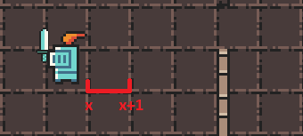
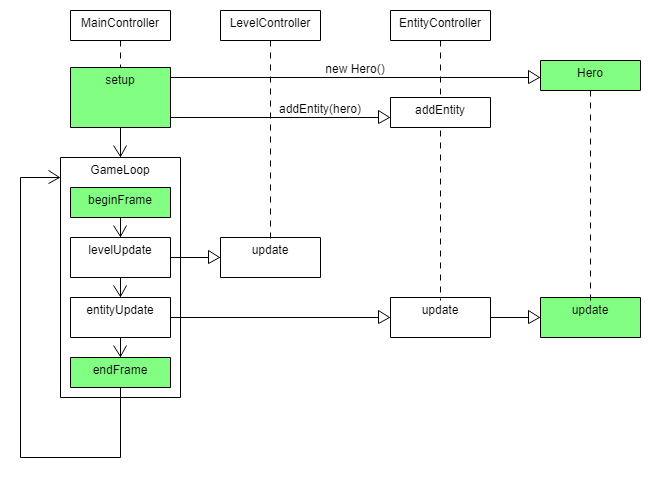

# PM-Dungeon

## Einleitung

Dieses Dokument liefert einen Einstieg in das PM-Dungeon. Es erläutert die Installation der API und erläutert Ihnen die ersten Schritte, um eigene Inhalte zum Dungeon hinzuzufügen. Es dient als Grundlage für alle weiteren Praktika. Lesen Sie das Dokument daher aufmerksam durch und versuchen Sie sich zusätzlich selbst mit dem Aufbau vertraut zu machen.

## Installation

- Laden Sie sich die *pmdungeon.jar* und den *assets* Ordner mit Texturen und Levelbeschreibungen herunter. Die *.jar* wird Ihnen als API dienen. 
- Erstellen Sie in Ihrer IDE ein neues Java Projekt
- Integrieren Sie die *pmdungeon.jar* als library in Ihrem Projekt
- Kopieren Sie den *assets* Ordner in Ihr Projektverzeichnis

## Grundlagen

Zu Beginn einige Grundlegen Prinzipien, die Sie verstanden haben sollten, bevor Sie mit dem Dungeon arbeiten.

- Das PM-Dungeon wird mithilfe des cross-platform Java Frameworks [**libGDX**](https://libgdx.com) umgesetzt. Dieses ist in der *pmdungeon.jar* bereits integriert, Sie müssen dieses nicht extra installieren. Die Ihnen zur Verfügung gestellten Vorgaben sind so umgesetzt, dass Sie kein tieferes Verständnis für das Framework benötigen, um die Aufgaben zu lösen. Sollten Sie allerdings einmal auf Probleme stoßen, kann es unter Umständen Helfen ein Blick in die Dokumentation von libGDX zu werfen. 
- Die API enthält bereits einige Level, Sie müssen sich daher nicht mit der Generierung von Dungeons auseinandersetzten. Level werden als 2D Array gespeichert, wobei jedes Feld entweder ein Boden, eine Wand oder *null* sein kann.
- Zwar wird das Level als 2D Array gespeichert und daher sind Koordinaten auch als integer bestimmbar, allerdings verwendet die API virtuelle Einheiten. (Welche Vorteile dieses Vorgehen liefert können Sie [hier](https://xoppa.github.io/blog/pixels/) nachlesen). Daher lassen Sich Entitäten auch zwischen den Feldern zeichnen.



- GameLoop: Die GameLoop ist die wichtigste Komponente des Spieles. Sie ist eine Endlosschleife welche einmal pro [Frame](https://de.wikipedia.org/wiki/Bildfrequenz) aufgerufen wird. Das Spiel läuft in 30-FPS also 30 Frames per seconds zu Deutsch 30 Bildern pro Sekunde, die GameLoop wird also 30mal in der Sekunde aufgerufen. Alle Aktionen die wiederholt ausgeführt werden müssen, wie zum Beispiel das Bewegen und Zeichnen von Figuren, müssen innerhalb der GameLoop stattfinden. Die API ermöglicht es Ihnen eigene Aktionen in die GameLoop zu integrieren. Wie genau das geht, erfahren Sie im Laufe dieser Dokumentation.

  *Hinweis: Die GameLoop wird automatisch ausgeführt, Sie müssen sie nicht aktiv aufrufen.* 

## Erster Start

In diesen Abschnitt werden alle Schritte erläutert, die zum ersten Start der Anwendung führen.

- Legen Sie sich eine neue Klasse an .

- Ihre Klasse muss von der Klasse **MainController** erben.

- Überschreiben Sie alle notwendigen Methoden. 

  - `protected void setup()`
  - `protected void beginFrame()`
  - `protected void endFrame()`
  - `public void onLevelLoad()`

  *Hinweis: Weitere Informationen zu diesen Methoden erfolgen im Laufe der Dokumentation.* 


- Fügen Sie die Main Methode hinzu.

  - ```java
    public static void main (String[]args){
    	DesktopLauncher.run(new YourClass());
    }
    ```

Das Spiel sollte nun starten und Sie sollten ein schwarzes Fenster mit einem Teil des Dungeon in der oberen rechten Ecke sehen.

Bevor wir nun unseren Helden implementieren sollten wir verstehen, was genau der *MainController* eigentlich ist. Wie der Name schon vermuten lässt, ist dies die Haupt-Steuerung des Spiels. Er bereitet alles für den Start des Spieles vor, verwaltet die anderen Controller und enthallt die GameLoop. Wir nutzten unsere Klasse welche vom *MainController* erbt, um selbst in die GameLoop einzugreifen und unsere eigenen Objekte wie Helden und Monster zu verwalten. Der *MainController* ist der Punkt, an den alle Fäden des Dungeons zusammenlaufen. Im Folgenden wird Ihnen erklärt, wie Sie erfolgreich mit dem *MainController* arbeiten.

## Eigener Held

Jetzt wo Sie sichergestellt haben, dass das Dungeon ausgeführt werden kann, geht es darum das Spiel mit Ihren Inhalten zu erweitern. Im Folgenden wird ein rudimentärer Held implementiert, um Ihnen die verschiedenen Aspekte des Dungeon zu erläutern. 

Fangen wir damit an eine neue Klasse für den Helden anzulegen. Da unser Held eine Animation haben soll, implementieren wir das Interface *IAnimatable* dies erlaubt es uns bequem unseren Helden zu animieren. Für Objekte, die keine Animation haben, sondern nur eine Textur, würden wir das Interface *IDrawable* implementieren.

```Java
public class MyHero implements IAnimatable{    
 	@Override
 	public Animation getActiveAnimation()
}
```

<div style="page-break-after: always"></div>

Fangen wir damit an, die Animation für unseren Helden zu erstellen. Eine Animation ist eine Liste mit verschieden Texturen, die nacheinander abgespielt werden.

```java
//Anlegen einer Animation 
private Animation idleAnimation;
private Hero(){    
    //Erstellen einer ArrayList
    List <Texture> idle = new ArrayList<>();
    //Laden der Texturen für die Animation (Pfad angeben)
    idle.add(new Texture(PATH_TO_TEXTURE_1.png));
    idle.add(new Texture(PATH_TO_TEXTURE_1.png));       
    //Erstellen einer Animation, als Parameter wird die Liste mit den Texturen 
    //und die Wartezeit (in Frames) zwischen den Wechsel der Texturen angegeben
    idleAnimation  = new Animation(idle,8);
}

	@Override
	//Da unser Held aktuell nur eine Animation hat, 
	//geben wir diese als aktuell aktive Animation zurück
	public Animation getActiveAnimation() return this.idle;
```

Super, jetzt hat unser Held eine Animation. Nun muss diese noch im Spiel gezeichnet werden.  

Da das Dungeon framebasiert ist, muss unser Held jeden Frame (30-mal in der Sekunde) neu gezeichnet werden. Dazu verwenden Wir das *IEntity* Interface, welches uns erlaubt Objekte vom *EntityController* managen zu lassen.  

Der *EntityController* verwendet das Visitor-Pattern (vergleiche Vorlesung) um Instanzen vom Typen *IEntity* zu verwalten. Er sorgt dafür, dass die vom Interface bereitgestellte `update` Methode jeder Entität in der GameLoop aufgerufen wird. Dazu hält er eine Liste mit allen, ihn übergebenen, Entitäten. Weiter unten sehen Sie, wie Sie den *EntityController* verwenden können, um unseren Helden managen zu lassen.  

*Hinweis: Der MainController verfügt bereits über einen EntityController, welchen Sie innerhalb der Klasse mit `entityController` ansprechen können* 

Dafür implementiert unser Held nun zusätzlich das *IEntity* Interface und die `update` Methode.

```java
public class MyHero implements IAnimatable, IEntity {
	....

	@Override
	public void update() {
	//zeichnet den Helden. 
        //Wird als default Methode vom IAnimatable Interface mitgeliefert 
	this.draw();
	}
```

<div style="page-break-after: always"></div>

Jetzt ist unsere erste Version vom Helden fast fertig, wir benötigen lediglich noch ein paar kleiner Informationen. Zuerst muss unser Held wissen, wo er überhaupt im Dungeon steht, dafür benötigt er eine Position. Zusätzlich wäre es hilfreich, wenn unser Held das Level kennen würde, da wir so vermeiden können, dass sich unser Held durch Wände bewegt oder sich außerhalb des eigentlichen Spielbereiches aufhält.

```java
//Positionen werden als float x und float y in der Klasse Point gespeichert
private Point position;
//Das Level ist eine Instanz der Klasse DungeonWorld
private DungeonWorld level;

//So können wir später dem Helden das aktuelle Level übergeben
public void setLevel (DungeonWorld level) {
    this.level=level; 
    //siehe unten
    findRandomPostion();
}
//Dem Helden eine zufällige Position im Dungeon zuweisen
public void findRandomPostion(){
    //Die Methode gibt ein zufälliges Bodenfeld im Dungeon zurück
    this.position=new Point(level.getRandomPointInDungeon());
}
```

Jetzt wo unser Held erst einmal fertiggestellt ist, müssen wir ihn noch im Dungeon einfügen. Dies tun wir in unserer *MainController* Klasse.

Die Methode `setup` ermöglich es uns einmalig zu Beginn der Anwendung Vorbereitungen zu treffen. Wir nutzen dies nun, um unseren Helden anzulegen und ihn dem *EntityController* zu übergeben. 

```java
//Unser Held
private Hero hero;  
@Override
public void setup() {
	//Erstellung unseres Helden
	hero = new Hero();
	//Ab jetzt kümmert sich der EntityController um das aufrufen von Held.update
	entityController.addEntity(hero);
	//unsere Kamera soll sich immer auf den Helden zentrieren.
	camera.follow(hero);
}
```

Die Kamera `camera` ist unser Auge im Dungeon. Mit `camera.follow` können wir ihr ein Objekt übergeben, welches von nun an immer im Mittelpunkt des Bildes sein soll.

<div style="page-break-after: always"></div>

Jetzt müssen wir unseren Helden nur noch im Level platzieren. Dafür bietet Sich die Methode `onLevelLoad` an, diese wird immer dann automatisch Aufgerufen, wenn der *LevelController* ein neues Level lädt. Der *LevelController* ist dafür zuständig die Struktur des Dungeons zu laden und zu zeichnen. Er hält die Referenz auf das eigentlich `DungeonWorld` Level. 

*Hinweis: Der MainController verfügt bereits über einen LevelController, welchen Sie innerhalb der Klasse mit `LevelController` ansprechen können*

```Java
@Override
public void onLevelLoad() {
	hero.setLevel(levelController.getDungeon());
}
```

Jetzt wird sich der Held bei jedem neuen Level eine zufällige Position im Dungeon suchen und sich dort positionieren.

Zu guter Letzt sollten wir noch prüfen, ob unser Held auf der Leiter zum nächsten Level steht und wenn ja, das nächste Level laden.

Die Methoden `beginFrame` und `endFrame` ermöglichen es uns, unsere eigenen Aktionen in die GameLoop zu integrieren. Alles was wir in der Methode `beginFrame` implementieren wird am Anfang jedes Frame ausgeführt, alles in `endFrame` am Ende eines Frames. 

Zum Überprüfen ob ein neues Level geladen werden soll, verwenden wir diesmal die `endFrame` Methode.

```Java
@Override
public void endFrame() {
	//Prüfe ob der übergebene Point auf der Leiter ist
	if( levelController.checkForTrigger(hero.getPosition())) 
	//Lade im nächsten Frame das nächste Level
		levelController.triggerNextStage();
}
```

<div style="page-break-after: always"></div>

Damit wir unser Spiel auch richtig testen können, sollten wir unseren Helden noch die Möglichkeit zum bewegen geben. Dafür fügen wir Steuerungsoptionen in der `Held.upate` Methode hinzu

```Java
//Temporären Point um den Held nur zu bewegen, wenn es keine Kollision gab
Point newPosition= new Point (this.position);
//Unser Held soll sich pro Schritt um 0.1 Felder bewegen. 
float movementSpeed=0.1f    
//Wenn die Taste W gedrückt ist, bewege dich nach oben
if (Gdx.input.isKeyPressed(Input.Keys.W)) 
	newPosition.y+=movementSpeed;
//Wenn die Taste S gedrückt ist, bewege dich nach unten
if (Gdx.input.isKeyPressed(Input.Keys.S))
	newPosition.y-=movementSpeed;
//Wenn die Taste D gedrückt ist, bewege dich nach rechts
if (Gdx.input.isKeyPressed(Input.Keys.D))
	newPosition.x += movementSpeed;
//Wenn die Taste A gedrückt ist, bewege dich nach links
if (Gdx.input.isKeyPressed(Input.Keys.A))
	newPosition.x-=movementSpeed;
//gibt dann true zurück, wenn der übergebene Punkt betretbar ist
if(level.isTileAccessible(newPosition))
   //wenn die neue Position gültig ist, ist das nun die aktuelle Position
   this.position=newPosition;
```

Starten wir nun das Spiel, sollten wir in der Lage sein unseren Helden zu sehen und durch das Dungeon zu bewegen. 

<div style="page-break-after: always"></div>

Unten sehen Sie eine vereinfachte Darstellung wie unser Dungeon jetzt funktioniert. Grün hinterlegte Felder müssen selbst implementiert werden, Weiß hinterlegte Felder sind bereits von der API implementiert. 




## Abschlusswort

Sie haben nun die ersten Schritte im Dungeon gemacht. Von nun an müssen Sie selbst entscheiden, wie Sie die Aufgaben im Praktikum umsetzten möchten. Ihnen ist mit Sicherheit aufgefallen das einige Interface Methode in diesem Dokument noch nicht erläutert wurden, machen Sie sich daher mit der javadoc der API vertraut. 

 

