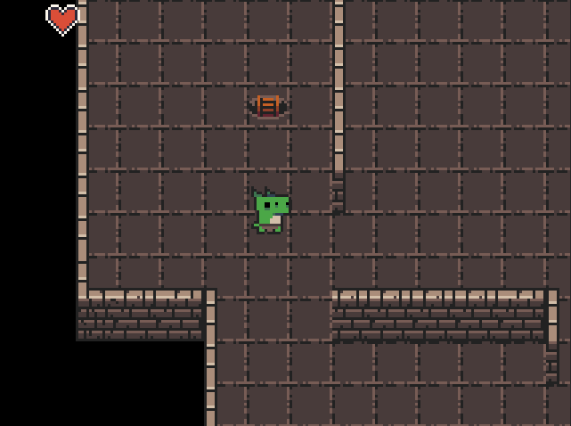

---
title: "Dokumentation zum PM-Dungeon"
author: "André Matutat"
lang: de-DE
...


## Einleitung

Dieses Dokument liefert einen Einstieg in das PM-Dungeon. Es erläutert die Installation der API und erläutert Ihnen die ersten Schritte, um eigene Inhalte zum Dungeon hinzuzufügen. Es dient als Grundlage für alle weiteren Praktika. Lesen Sie das Dokument daher aufmerksam durch und versuchen Sie sich zusätzlich selbst mit dem Aufbau vertraut zu machen.

## Installation

- Laden Sie sich das `pmdungeon.jar` und den `assets`-Ordner mit Texturen und Level-Beschreibungen herunter. Das `pmdungeon.jar` wird Ihnen als API dienen.
- Erstellen Sie in Ihrer IDE ein neues Java-Projekt
- Integrieren Sie die `pmdungeon.jar` als Library in Ihrem Projekt
- Kopieren Sie den `assets`-Ordner in Ihr Projektverzeichnis

## Grundlagen

Zu Beginn einige grundlegende Prinzipien, die Sie verstanden haben sollten, bevor Sie mit dem Dungeon arbeiten.

- Das PM-Dungeon wird mithilfe des Cross-Plattform Java-Frameworks [`libGDX`](https://libgdx.com) umgesetzt. Dieses ist in der `pmdungeon.jar` bereits integriert, Sie müssen dieses nicht extra installieren. Die Ihnen zur Verfügung gestellten Vorgaben sind so umgesetzt, dass Sie kein tieferes Verständnis für das Framework benötigen, um die Aufgaben zu lösen. Sollten Sie allerdings einmal auf Probleme stoßen, kann es unter Umständen helfen, einen Blick in die Dokumentation von `libGDX` zu werfen.
- Die API enthält bereits einige vordefinierte Spiel-Level (Ebenen im Dungeon). Sie müssen sich daher nicht mit der Generierung von Dungeons auseinandersetzen. Level werden als 2D-Array gespeichert, wobei jedes Feld entweder ein Boden, eine Wand oder `null` sein kann.
- Zwar wird das Level als 2D-Array gespeichert und daher sind Koordinaten auch als Integer-Tupel bestimmbar, allerdings verwendet die API intern virtuelle Einheiten. (Welche Vorteile dieses Vorgehen liefert können Sie [hier](https://xoppa.github.io/blog/pixels/) nachlesen). Daher lassen sich Entitäten auch zwischen den Feldern zeichnen.


- Game-Loop: Die Game-Loop ist die wichtigste Komponente des Spieles. Sie ist eine Endlosschleife, welche einmal pro [Frame](https://de.wikipedia.org/wiki/Bildfrequenz) aufgerufen wird. Das Spiel läuft in 30-FPS (also 30 *frames per seconds*, zu Deutsch 30 Bildern pro Sekunde), die Game-Loop wird also 30mal in der Sekunde aufgerufen. Alle Aktionen, die wiederholt ausgeführt werden müssen, wie zum Beispiel das Bewegen und Zeichnen von Figuren, müssen innerhalb der Game-Loop stattfinden. Die API ermöglicht es Ihnen, eigene Aktionen in die Game-Loop zu integrieren. Wie genau das geht, erfahren Sie im Laufe dieser Dokumentation.

  *Hinweis: Die Game-Loop wird automatisch ausgeführt, Sie müssen sie nicht aktiv aufrufen.*

## Erster Start

In diesen Abschnitt werden alle Schritte erläutert, die zum ersten Start der Anwendung führen.

- Legen Sie sich eine neue Klasse an.

- Ihre Klasse muss von der Klasse **`MainController`** erben.

- Überschreiben Sie alle notwendigen Methoden:

  - `protected void setup()`
  - `protected void beginFrame()`
  - `protected void endFrame()`
  - `public void onLevelLoad()`

  *Hinweis: Weitere Informationen zu diesen Methoden erfolgen im Laufe der Dokumentation.*


- Fügen Sie die `main`-Methode hinzu.

    ```java
    public static void main(String[] args) {
        DesktopLauncher.run(new YourClass());
    }
    ```

Das Spiel sollte nun starten und Sie sollten ein schwarzes Fenster mit einem Teil des Dungeons in der oberen rechten Ecke sehen.

Bevor wir nun unseren Helden implementieren sollten wir verstehen, was genau der `MainController` eigentlich ist. Wie der Name schon vermuten lässt, ist dies die Haupt-Steuerung des Spiels. Er bereitet alles für den Start des Spieles vor, verwaltet die anderen Controller und enthält die Game-Loop. Wir nutzen unsere Klasse, welche vom `MainController` erbt, um selbst in die Game-Loop einzugreifen und unsere eigenen Objekte wie Helden und Monster zu verwalten. Der `MainController` ist der Punkt, an dem alle Fäden des Dungeons zusammenlaufen. Im Folgenden wird Ihnen erklärt, wie Sie erfolgreich mit dem `MainController` arbeiten.

## Eigener Held

Jetzt, wo Sie sichergestellt haben, dass das Dungeon ausgeführt werden kann, geht es darum, das Spiel mit Ihren Inhalten zu erweitern. Im Folgenden wird ein rudimentärer Held implementiert, um Ihnen die verschiedenen Aspekte des Dungeon zu erläutern.

Fangen wir damit an eine neue Klasse für den Helden anzulegen. Da unser Held eine Animation haben soll, implementieren wir das Interface `IAnimatable`. Dies erlaubt es uns, unseren Helden zu animieren. Für Objekte, die keine Animation haben, sondern nur eine Textur, würden wir das Interface `IDrawable` implementieren.

```java
public class Hero implements IAnimatable {
    @Override
    public Animation getActiveAnimation()
}
```

### Der bewegte (animierte) Held

Fangen wir damit an, die Animation für unseren Helden zu erstellen. Eine Animation ist eine Liste mit verschieden Texturen, die nacheinander abgespielt werden.

```java
//Anlegen einer Animation
private Animation idleAnimation;
public Hero() {
    //Erstellen einer ArrayList
    List <Texture> idle = new ArrayList<>();
    //Laden der Texturen für die Animation (Pfad angeben)
    idle.add(new Texture(PATH_TO_TEXTURE_1.png));
    idle.add(new Texture(PATH_TO_TEXTURE_1.png));
    //Erstellen einer Animation, als Parameter wird die Liste mit den Texturen
    //und die Wartezeit (in Frames) zwischen den Wechsel der Texturen angegeben
    idleAnimation = new Animation(idle,8);
}

@Override
//Da unser Held aktuell nur eine Animation hat,
//geben wir diese als aktuell aktive Animation zurück
public Animation getActiveAnimation() {
    return this.idle;
}
```

Super, jetzt hat unser Held eine Animation. Nun muss diese noch im Spiel gezeichnet werden.

Da das Dungeon framebasiert ist, muss unser Held in jedem Frame (also 30-mal in der Sekunde) neu gezeichnet werden. Dazu verwenden Wir das `IEntity` Interface, welches uns erlaubt Objekte vom `EntityController` managen zu lassen.

Der `EntityController` verwendet das *Observer-Pattern* (vergleiche Vorlesung) um Instanzen vom Typen `IEntity` zu verwalten. Er sorgt dafür, dass die vom Interface bereitgestellte `update`-Methode jeder Entität in der Game-Loop aufgerufen wird. Dazu hält er eine Liste mit allen ihm übergebenen Entitäten. Weiter unten sehen Sie, wie Sie den `EntityController` verwenden können, um unseren Helden managen zu lassen.

*Hinweis: Der `MainController` verfügt bereits über einen `EntityController`, welchen Sie innerhalb der Klasse mit `entityController` ansprechen können*

Dafür implementiert unser Held nun zusätzlich das `IEntity`-Interface und die `update`-Methode.

```java
public class Hero implements IAnimatable, IEntity {
    ....

    @Override
    public void update() {
        //zeichnet den Helden.
        //Wird als default Methode vom IAnimatable Interface mitgeliefert
        this.draw();
    }
}
```

### Wo bin ich?

Jetzt ist unsere erste Version vom Helden fast fertig, wir benötigen lediglich noch ein paar kleinere Informationen. Zuerst muss unser Held wissen, wo er überhaupt im Dungeon steht, dafür benötigt er eine Position. Zusätzlich wäre es hilfreich, wenn unser Held das Level (die Dungeon-Ebene) kennen würde, da wir so vermeiden können, dass sich unser Held durch Wände bewegt oder sich außerhalb des eigentlichen Spielbereiches aufhält.

```java
//Positionen werden als float x und float y in der Klasse Point gespeichert
private Point position;
//Das Level ist eine Instanz der Klasse DungeonWorld
private DungeonWorld level;

//So können wir später dem Helden das aktuelle Level übergeben
public void setLevel(DungeonWorld level) {
    this.level = level;
    //siehe unten
    findRandomPostion();
}
//Dem Helden eine zufällige Position im Dungeon zuweisen
public void findRandomPostion(){
    //Die Methode gibt ein zufälliges Bodenfeld im Dungeon zurück
    this.position = new Point(level.getRandomPointInDungeon());
}
```

Jetzt wo unser Held erst einmal fertiggestellt ist, müssen wir ihn noch im Dungeon einfügen. Dies tun wir in unserer `MainController`-Klasse.

Die Methode `setup` ermöglicht es uns, einmalig zu Beginn der Anwendung Vorbereitungen zu treffen. Wir nutzen dies nun, um unseren Helden anzulegen und ihn dem `EntityController` zu übergeben.

```java
//Unser Held
private Hero hero;
@Override
public void setup() {
    //Erstellung unseres Helden
    hero = new Hero();
    //Ab jetzt kümmert sich der EntityController um das aufrufen von Held.update
    entityController.addEntity(hero);
    //unsere Kamera soll sich immer auf den Helden zentrieren.
    camera.follow(hero);
}
```

Die Kamera `camera` ist unser "Auge" im Dungeon. Mit `camera.follow` können wir ihr ein Objekt übergeben, welches von nun an immer im Mittelpunkt des Bildes sein soll.

### Sie werden platziert

Jetzt müssen wir unseren Helden nur noch im Level platzieren. Dafür bietet Sich die Methode `onLevelLoad` an, diese wird immer dann automatisch aufgerufen, wenn der `LevelController` ein neues Level lädt. Der `LevelController` ist dafür zuständig, die Struktur des Dungeons zu laden und zu zeichnen. Er hält eine Referenz auf das eigentliche `DungeonWorld`-Level.

*Hinweis: Der `MainController` verfügt bereits über einen `LevelController`, welchen Sie innerhalb der Klasse mit `LevelController` ansprechen können*

```java
@Override
public void onLevelLoad() {
    hero.setLevel(levelController.getDungeon());
}
```

Jetzt wird sich der Held bei jedem neuen Level eine zufällige Position im Dungeon suchen und sich dort positionieren.

Zu guter Letzt sollten wir noch prüfen, ob unser Held auf der Leiter zum nächsten Level steht und wenn ja, das nächste Level laden (also die Leiter herab steigen in die nächste Ebene des Dungeons).

Die Methoden `beginFrame` und `endFrame` ermöglichen es uns, unsere eigenen Aktionen in die Game-Loop zu integrieren. Alles, was wir in der Methode `beginFrame` implementieren, wird am Anfang jedes Frames ausgeführt, analog alles in `endFrame` am Ende eines Frames.

Zum Überprüfen, ob ein neues Level geladen werden soll, verwenden wir diesmal die `endFrame`-Methode.

```java
@Override
public void endFrame() {
    //Prüfe ob der übergebene Point auf der Leiter ist
    if (levelController.checkForTrigger(hero.getPosition())) {
        //Lade im nächsten Frame das nächste Level
        levelController.triggerNextStage();
    }
}
```

### WSDA oder die Steuerung des Helden über die Tastatur

Damit wir unser Spiel auch richtig testen können, sollten wir unserem Helden noch die Möglichkeit zum Bewegen geben. Dafür fügen wir Steuerungsoptionen in der `Held.upate`-Methode hinzu:

```java
//Temporären Point um den Held nur zu bewegen, wenn es keine Kollision gab
Point newPosition = new Point(this.position);
//Unser Held soll sich pro Schritt um 0.1 Felder bewegen.
float movementSpeed = 0.1f;
//Wenn die Taste W gedrückt ist, bewege dich nach oben
if (Gdx.input.isKeyPressed(Input.Keys.W))
    newPosition.y += movementSpeed;
//Wenn die Taste S gedrückt ist, bewege dich nach unten
if (Gdx.input.isKeyPressed(Input.Keys.S))
    newPosition.y -= movementSpeed;
//Wenn die Taste D gedrückt ist, bewege dich nach rechts
if (Gdx.input.isKeyPressed(Input.Keys.D))
    newPosition.x += movementSpeed;
//Wenn die Taste A gedrückt ist, bewege dich nach links
if (Gdx.input.isKeyPressed(Input.Keys.A))
    newPosition.x -= movementSpeed;
//Wenn der übergebene Punkt betretbar ist, ist das nun die aktuelle Position
if (level.isTileAccessible(newPosition))
   this.position = newPosition;
```

Starten wir nun das Spiel, sollten wir in der Lage sein, unseren Helden zu sehen und durch das Dungeon zu bewegen.

### Ein letzter Überblick

Unten sehen Sie eine vereinfachte Darstellung wie unser Dungeon jetzt funktioniert. Grün hinterlegte Felder müssen selbst implementiert werden, weiß hinterlegte Felder sind bereits von der API implementiert.


## Head-up-Display (HUD)

Dieser Abschnitt soll Ihnen die Werkzeuge nahebringen, welche Sie für die Darstellung eines HUD benötigen. Anders als im bereits bekannten Vorgehen, verwendet das HUD Koordinaten im Bereich von `x: 0 bis 6` und `y: 0 bis 5`, dabei stehen Ihnen auch `float`-Werte zur Verfügung.

Um eine Grafik auf dem HUD anzeigen zu können, erstellen wir zuerst eine neue Klasse, welche das Interface `IHUDElement` implementiert.

```java
public class HeartIcon implements IHUDElement {
    @Override
    public Point getPosition() {
        //festlegen der Position
        return new Point(0.5f,4.5f);
    }

    @Override
    public Texture getTexture() {
        //laden der Textur
        return new Texture("./assets/textures/ui/ui_heart_full.png");
    }
}
```

Die Methode `getTexture` gibt die gewünschte Grafik als `Texture`-Objekt zurück, dies funktioniert identisch zur bereits bekannten Helden-Implementierung. Die Methode `getPosition` gibt die Position der Grafik auf dem HUD zurück. In diesem Beispiel gehen wir von einer festen Position der Grafik aus. Es wird vorkommen, dass Sie Grafiken in Abhängigkeit zu anderen Grafiken positionieren möchten, überlegen Sie sich daher bereits jetzt eine gute Struktur, um Ihre HUD-Elemente abzuspeichern.

Jetzt müssen wir unsere Grafik nur noch anzeigen lassen. Ähnlich zu den bereits bekannten Controllern gibt es auch für das HUD eine Steuerungsklasse, welche im `MainController` mit `hud` angesprochen werden kann.

```java
public class YourClass extends MainController {
     @Override
    protected void setup() {
        ...
        // hinzufügen eines Elementes zum HUD
        hud.addHudElement(new HeartIcon());
        //so entfernt man ein Element
        //hud.removeHudElement();
    }
}
```



Unter Umständen möchten Sie Ihre Grafiken dynamisch skalieren. Überschreiben Sie dazu die Defaultmethoden `float getWidth()` und `float getHeight()` des `IHUDElement`-Interfaces. Die Skalierung scheint nicht immer ganz logisch, scheuen Sie daher nicht, mit den Werten zu experimentieren.

## Abschlusswort

Sie haben nun die ersten Schritte im Dungeon gemacht. Von nun an müssen Sie selbst entscheiden, wie Sie die Aufgaben im Praktikum umsetzten möchten. Ihnen ist mit Sicherheit aufgefallen, dass einige Interface-Methoden in diesem Dokument noch nicht erläutert wurden. Machen Sie sich daher mit der Javadoc der API vertraut.

## Zusätzliche Funktionen
Hier wird eine Liste von Funktionen präsentiert, welche Sie zum Lösen der Praktikumsaufgaben zwar nicht benötigen, aber dennoch gerne verwenden können. 

Die Liste wird in unregelmäßigen Abständen erweitert.


### Sound
Möchten Sie Soundeffekte oder Hintergrundmusik zu Ihrem Dungeon hinzufügen, bietet `libGDX` eine einfache Möglichkeit dafür. 

Es werden die Formate `.mp3`, `.wav` und `.ogg` unterstützt. Das Vorgehen unterscheidet sich zwischen den Formaten nicht. 

```java
//Datei als Sound-Objekt einladen
Sound bumSound = Gdx.audio.newSound(Gdx.files.internal("assets/sound/bum.mp3"));
bumSound.play();
//Sound leise abspielen
bumSound.play(0.1f);
//Sound mit maximal Lautstärke abspielen
bumSound.play(1f);
//Soud endlos abspielen
bumSound.loop(); 
```


Sie können noch weitere Parameter und Methoden verwenden, um den Sound Ihren Wünschen anzupassen. Schauen Sie dafür in die [`libGDX`-Dokumentation](https://libgdx.badlogicgames.com/ci/nightlies/docs/api/com/badlogic/gdx/audio/Sound.html)

### Text

Ab Version 1.1.4.0 können Sie Texte mithilfe von `TextStage` auf den Bildschirm zeichnen. Verwenden Sie dafür die `TextStage`-Instanz `textHUD` welche bereits in Ihrem `MainController` verfügbar ist. 

Verwenden Sie die Methode `TextStage.drawText` um einen String auf Ihren Bildschirm zu zeichnen. Sie haben dabei eine umfangreiche Auswahl an Parametern, um Ihre Einstellungen anzupassen. Beachten Sie, dass die Positionen des Texts dieses Mal in echten Pixeln angegeben werden muss (wir arbeiten bereits daran ein einheitliches Positionssystem zu entwickeln, bis dahin müssen Sie leider mit den unterschiedlichen Systemen arbeiten). 

`TextStage.drawText` gibt Ihnen ein `Label`-Objekt zurück, dieses können Sie verwenden, um den Text später anzupassen oder ihn vom Bildschirm zu entfernen. 

 Im unteren Beispiel wird ein Text implementiert, welcher das aktuelle Level ausgibt.

```java
public class MyMain extends MainController {
    .....
    Label levelLabel; 
    int levelCounter=0;
    public void onLevelLoad() {
        levelCounter++;
        if (levelCounter==1) levelLabel=textHUD.drawText("Level"+x,"PATH/TO/FONT.ttf",Color.RED,30,50,50,30,30);
        else levelLabel.setText("Level"+x)
    }
    //remove label
    //textHUD.removeText(levelLabel)
    //remove all label
    //textHUD.clear();
}
```

Genauere Informationen zu den Parametern entnehmen Sie bitte der JavaDoc. 


*Hinweis: Achten Sie darauf, Daten nur dann in öffentliche Git-Repos zu laden, wenn Sie die nötigen Rechte an diesen Daten haben. Dies gilt insbesondere auch für Artefakte wie Bilder, Bitmaps, Musik oder Soundeffekte.* 